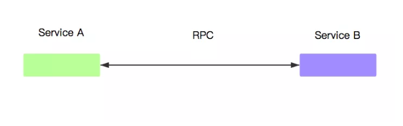
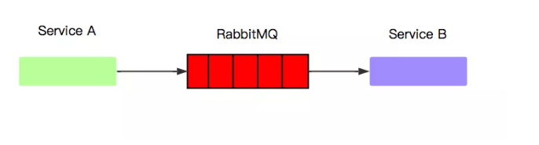
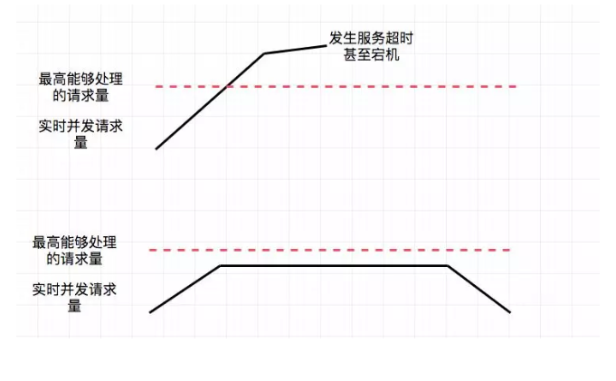
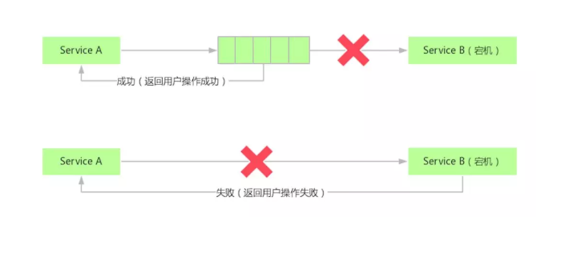
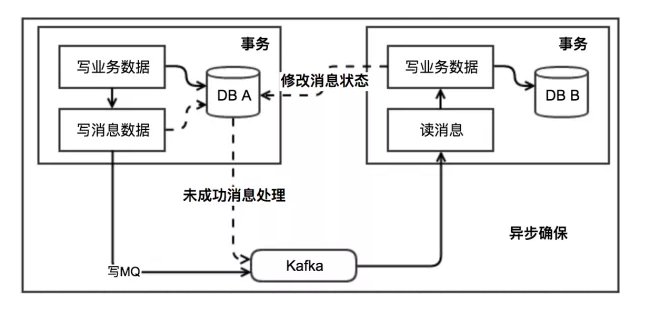

## 解决的问题

一项技术的产生必然是为了解决问题而生，了解了一项技术解决的问题，就能够很轻松的理解这项技术的设计根本，从而更好地理解与使用这项技术。
消息中间件和RPC从根本上来说都是为了解决分布式系统的服务间通信问题，我们的服务从最初的单体应用发展到SOA架构到现在的微服务架构，必不可少的就是服务间通信，但从最初的设想，服务间通信仅仅就是一次请求响应调用而已，为什么发展出如此多的消息中间件与RPC技术，我们是否真的需要学习这么多的消息中间件技术？
答案是肯定的，接下来我们将分析我们为什么要了解及使用如此多的服务间通信技术，以及他们究竟都解决了哪些问题，在什么场景下他们是必不可少的。

## 消息中间件 VS RPC

首先来说一下什么是消息中间件和RPC，简单来说，他们最主要的区别是，完成一次服务间通信需要的组件数量，本篇文章我们先来讨论一下消息中间件的优势与使用场景

### RPC

### 消息中间件

从上面两幅图可以清晰地看出消息中间件比RPC要多了一个组件，那就是消息中间件本身，从而我们也能想到，使用消息中间件通信时，相较于使用RPC通信，会有更多的组件运维成本，也会增加一次通信的通信延迟，那么我们为什么要使用消息中间件？一个很重要的原因就是，他为我们增加了消息堆积能力，而这个能力提供给我们了很重要的流量削峰，高可用以及广播等问题的解决方案。

### 流量削峰

流量削峰是指在发生突发性流量增长时，并不会让上游服务（接收请求的服务）出现超负荷并发从而导致宕机等风险，MQ（消息队列）的解决方案是将流量暂缓存至自己的Queue中，将稳定的持续的将流量发送给消费者。

(在发生流量突增时，上游服务的实时消息处理量，RPC（上），MQ（下）)
上面的图展示的是不同时间段上游服务的请求量曲线，可以看出，通过RPC进行请求的上游服务在短时间内会接收大量超出最高负载的请求，从而可能引发大量的请求超时和CPU 100%导致的服务宕机等情况。而通过MQ进行通信时，若MQ发现接收到的请求超出消费者的最大负载时，则会将请求暂存至消息队列中，并将请求保持在一个持续稳定的量发送给消费者（上游服务），从而保证了系统的稳定。
流量削峰在面对例如秒杀等场景就显得尤为重要，例如淘宝的双十一整点秒杀，12306的整点放票等活动，消息队列均起到的重要作用，我们也就可以很好地理解，为什么12306在推出排队系统后，服务宕机的概率被大大减小了（虽然体验依旧是一团糟...😑）。
推荐中间件：RabbitMQ

### 使用消息中间件提高服务的可用性

可用性是指服务在某个时间段内正常运行的时间，提高可用性就是指减少服务的故障停机时间，那么MQ是如何提高服务的可用性的呢。

（当Service B宕机时的MQ（上）与RPC（下））
当上游出现问题时，将无法接收下游服务给予的请求，这时上游服务会因上游服务不能完成请求而报错，从而导致这个请求无法完成，导致整个系统不能接收更多的请求，用户就会感知到，服务挂掉了...
而消息中间件的处理方式是，上游服务出现宕机时，将消息缓存至消息队列中，等待上游服务恢复正常时，在继续处理请求。当然这里你应该也会发现，在该场景下，消息中间件更适合处理一些无需立即处理，也就是异步的请求，例如日志，数据持久化等操作，他们是并不需要返回或立即返回处理结果给用户的。
推荐中间件：Kafka

### 使用MQ实现事务的最终一致性

分布式事务是个极其复杂的话题，本文不展开讨论，这里主要讨论一下MQ在分布式事务中所起到的作用。
最终一致性简单地说就是弱一致性的一种，允许存在一定的不一致窗口，但要求在有限的时间内关闭不一致窗口并让所有系统最终一致。

（图片出处：http://www.cnblogs.com/savorboard/p/distributed-system-transaction-consistency.html）
上图描述了一个基于MQ实现最终一致性的一种解决方案（异步确保模式）。
主要描述的是DB A和DB B分属两个不同的数据中心要进行数据同步，消息发送方会将数据写入至MQ中并在本地记录消息标识（已发送的消息），当消息接收方接收到该消息并处理后会告知发送方处理结果（成功/失败），消息发送方对接收方的处理结果进行处理，如若处理失败则进行补偿操作。
（关于更多相关细节不在本文中过多讨论...）
MQ主要起到的作用有两点：

1. 采用异步方式提高了事务请求的性能及并发量，如果采用同步方式调用的事务请求并且事物的调用链非常长则会导致用户等待时间极长，并降低系统的并发量及可用性
2. 提供了消费方接收消息的重试机制，消费方能够处理该事务的前提是能够接收该事务，MQ更多的保证了不会因消费方宕机，网络超时等等原因的消费失败。