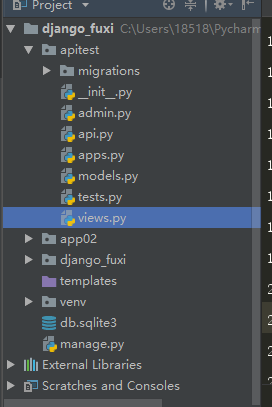

### 详解Django rest_framework实现RESTful API

##### 1.   pip3 install  djangorestframework

##### 2.  新建Django项目


##### 3.创建一个apitest APP

```
cd d:\Tool           # 切换到Tool目录
python manage.py startapp apitest  #创建apitest应用
```

##### 4.目录结构




4.打开settings.py，增加一段配置：

```
#coding=utf-8
from rest_framework import permissions
from rest_framework.response import Response
from rest_framework.decorators import api_view, permission_classes
from django.views.decorators.csrf import csrf_exempt
 
@csrf_exempt
@api_view(http_method_names=['post'])        #只允许post
@permission_classes((permissions.AllowAny,))
def inventory(request):
  parameter = request.data
  id = parameter['data']
  if id == 1:
    data = 'There are three dogs'
  elif id == 2:
    data = 'There are two dogs'
  else:
    data = 'nothing'
  return Response({'data':data})
```

5.在apitest目录下新建一个api.py，让我们来写一些测试代码：

```
#coding=utf-8
from rest_framework import permissions
from rest_framework.response import Response
from rest_framework.decorators import api_view, permission_classes
from django.views.decorators.csrf import csrf_exempt
 
@csrf_exempt
@api_view(http_method_names=['post'])        #只允许post
@permission_classes((permissions.AllowAny,))
def inventory(request):
  parameter = request.data
  id = parameter['data']
  if id == 1:
    data = 'There are three dogs'
  elif id == 2:
    data = 'There are two dogs'
  else:
    data = 'nothing'
  return Response({'data':data})
```


6.在urls.py添加刚刚创建的api路由：

```
urlpatterns = [
  path('admin/', admin.site.urls),
  path('food/', api.inventory),        #添加api中inventory路由
]
```

上面配置好了之后本地调试下，输入命令：python manage.py runserver 8000


好了，服务器端代码已经写完。我们可以通过约定好的名词food来获取或者更改资源。然后写个小脚本测试下上面的接口：

```
import requests
 
url= 'http://127.0.0.1:8000/food/'
data = {'data':2}
h=requests.post(url,json=data)
print(h.text)
```

输出：

测试OK

以上就是本文的全部内容，希望对大家的学习有所帮助，也希望大家多多支持脚本之家。