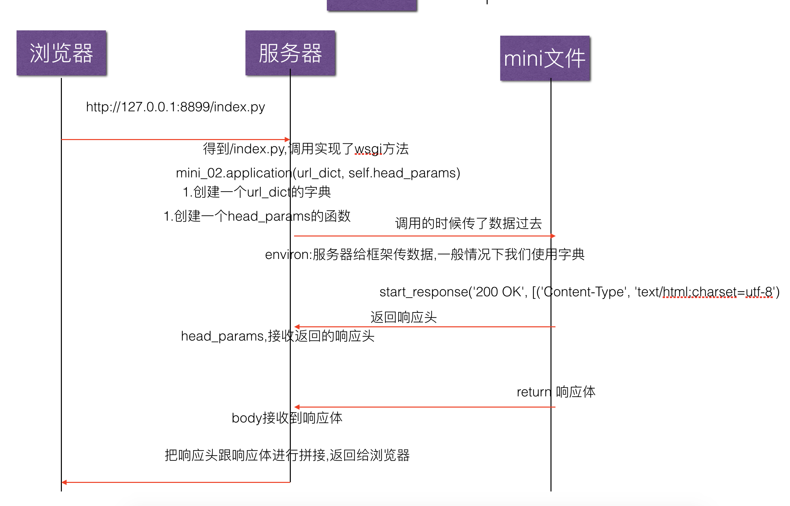

# WSGI协议		

**WSGI协议：（Web Server Gateway Interface，Web 服务器网关接口）**

​    WSGI是Python语言中所定义的Web服务器和Web应用程序之间或框架之间的通用接口标准。

​    WSGI就是一座桥梁，桥梁的一端称为服务端或网关端，另一端称为应用端或者框架端，WSGI的作用就是在协议之间进行转化。WSGI将Web组件分成了三类：**Web 服务器（WSGI Server）、Web中间件（WSGI Middleware）与Web应用程序（WSGI Application）。**

​    Web Server接收HTTP请求，封装一系列环境变量，按照WSGI接口标准调用注册的WSGI Application，最后将响应返回给客户端。

Web应用的本质：

​        1)、浏览器发送HTTP请求  

​        2)、服务器接收到请求，生成HTML文档

​        3)、服务器把HTML文档作为HTTP响应的Body发送给浏览器

​        4)、浏览器收到HTTP响应，从HTTP Body取出HTML文档进行显示

 

​        { 接受HTTP请求、解析HTTP请求、发送HTTP响应都是重复的苦力活，如果我们自己来写这些底层代码，还没开始写HTML，先要花半把个月研读HTTP规范。所以底层的代码应该由专门的服务器软件实现，我们用python专注于生成HTML文档。}

​        因为我们不想要接触TCP连接、HTTP原始请求和响应格式。所以需要一个统一的接口，专心用python编写Web业务。

​        这个接口就是 WSGI：(Web 服务器网关接口)。

 

WSGI接口

​    WSGI接口定义非常简单，它只要求Web开发者实现一个函数，就可以响应HTTP请求。

```
def application(environ, start_response):
start_response('200 OK', [('Content-Type', 'text/html;charset=utf-8')]) # charset=utf-8：中文编码
return 'Hello World!'
```

上面的application()函数就是符合WSGI标准的一个HTTP处理函数，它接收两个参数：

- environ：一个包含所有HTTP请求信息的dict对象，服务器给框架传数据
- start_response：一个发送HTTP响应的函数，框架给服务器传响应头相关信息
- start_response('200 OK', [('Content-Type', 'text/html')])： 表示响应Body的内容形式 
- start_response()函数接收两个参数：一个是HTTP响应码，一个是一组列表list表示的HTTP Header，每个Header用一个包含两个str的tuple表示。（响应头里的参数可以自己填写添加）

从environ这个dict对象拿到HTTP请求信息，然后构造HTML，通过start_response()发送Header，最后返回Body(HTTP响应格式)。



 

浏览器通过WSGI请求动态资源的过程

​    1.httpweb发送请求动态资源给服务器

​    2.webWSGI服务器收到请求后通过调用一个属性给（应用程序框架）

​    3.WSGIweb（应用程序框架）通过引用调用服务器的方法，设置返回的状态和头信息

​    4.web调用后返回，此时服务器保存了刚刚设置的信息

​    5.body（应用程序框架）查询数据库，生成动态页面的信息

​    6.bodyweb把生成的信息返回给服务器

​    7.web服务器把数据返回给浏览器